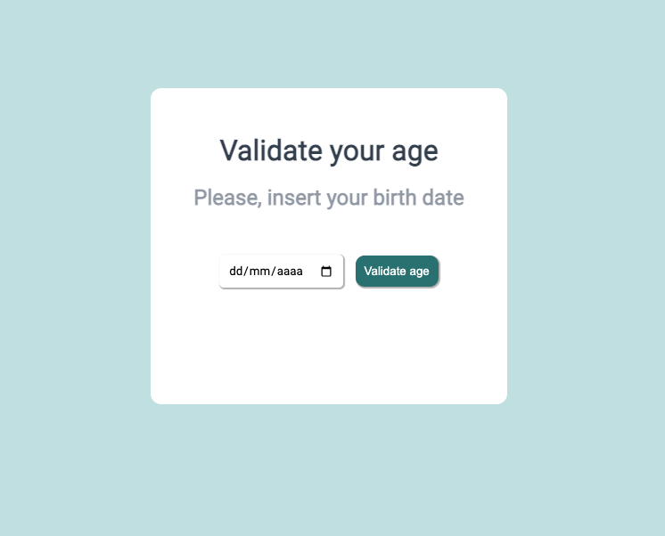

  <h1>Validate age</h1>

Age validation system, by entering the date of birth, the current age is shown and if the user has the required age.

  
Click <a href="https://bonieasy.github.io/Age/" target="_blank"> here </a> to access

## Tech Stack

HTML | CSS | Javascript

Made with :heart: by <a href="https://www.linkedin.com/in/ariele-bonifacio/" target="_blank">Ariele Bonifacio (Boni) </a>

